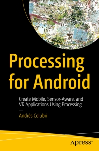

# Apress Source Code

This repository hosts all the code examples included in the book [*Processing for Android: Create Mobile, Sensor-Aware, and VR Applications Using Processing*](http://www.apress.com/us/book/9781484227183), by Andrés Colubri (Apress, 2017).

[comment]: #cover

Download the files as a zip using the green button, or clone the repository to your machine using Git. 

You can also install all the examples through the Contributions Manager in the Processing Development Environment (PDE).

## Releases 

Release v1.0 corresponds to the code in the published book, without corrections or updates.

## Contributions

See the file Contributing.md for more information on how you can contribute to this repository.